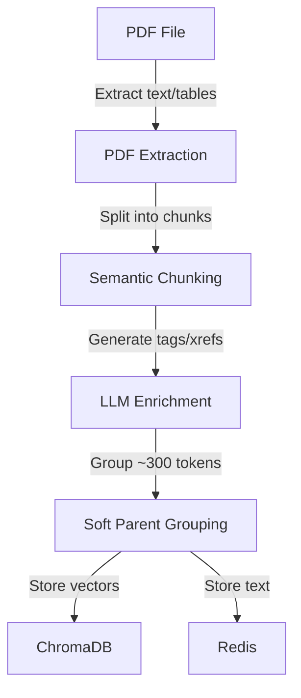
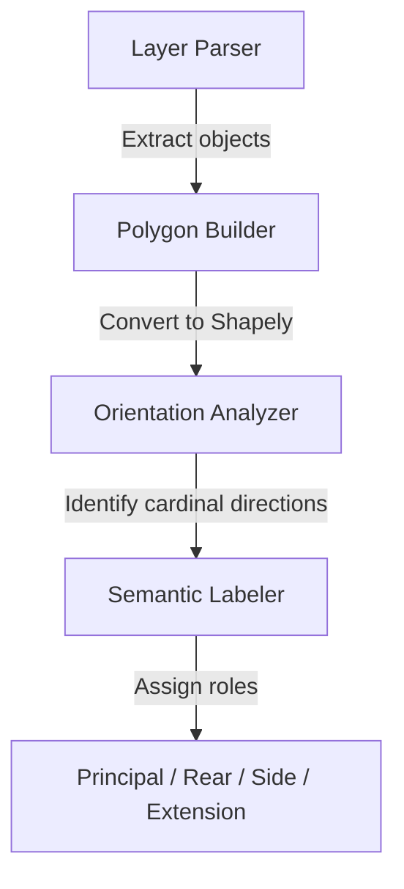
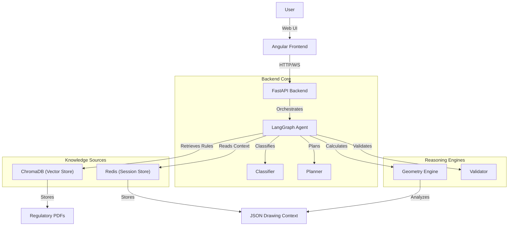

# Shapy

**Shapy** is a modular Conversational Q&A System designed to automate compliance checks for UK Permitted Development Rights. It implements a **Hybrid Retrieval Augmented Generation (RAG)** architecture that combines persistent regulatory knowledge (PDFs) with ephemeral, real time architectural context (JSON drawings).

## Features

### Hybrid RAG Engine
Seamlessly bridges the gap between unstructured legal text (PDFs) and structured geometric data (JSON).

### Smart Window Indexing
Implements a sophisticated ingestion pipeline that creates semantically meaningful "Rich Children" (combining text, tables, and diagrams) and groups them into "Soft Parents" (~300 tokens) to preserve context without cutting mid-sentence. The retrieval system employs a Hybrid Search strategy, combining Vector Search (ChromaDB) and Keyword Search (BM25) with Reciprocal Rank Fusion (RRF) for robust ranking. It further enhances precision through automatic Cross-Reference (X-REF) Resolution, expanding the context window to include referenced sections dynamically.



### Geometry Engine
At the core of the system lies a powerful Spatial Inference Pipeline built on the Shapely library. This engine autonomously bridges the semantic gap between raw coordinate data and legal terminology. It employs robust algorithms for Automatic Principal Elevation Identification, using multi-factor analysis (highway proximity, facade length, door placement) to orient the building correctly. The Calculation Core handles complex geometric operations like Shoelace area calculation for curtilage coverage and precise distance measurements for boundary rules. Finally, a Rule-based Compliance Validator translates natural language regulations into executable checks, verifying metrics against extracted thresholds.



### Agentic Workflow
Powered by a LangGraph orchestrator, this system moves beyond simple chains to a cyclic State Graph architecture. It implements Plan Execute erify loops to break down complex compliance queries. A key innovation is the "Assumption Analysis" node, which explicitly detects temporal ("original dwellinghouse") and contextual ("designated land") ambiguities, triggering Human in the Loop interactions to resolve missing information before finalizing a verdict.

### Interactive Frontend
An Angular based UI for visualizing drawings, managing sessions, and streaming reasoning steps in real time.

## Architecture

Shapy is built on a modern, event driven architecture designed for scalability and precision.



### Key Components

#### 1. Backend (FastAPI & LangGraph)
**Orchestrator**: Manages the conversation flow and state.
**Classifier**: Determines if a query requires PDF lookup, geometric calculation, or both.
**Geometry Engine**: Performs spatial analysis (Shoelace area, boundary distance, wall projections).
**Validator**: Compares calculated values against retrieved regulatory thresholds.

#### 2. Data Layer
**ChromaDB**: Stores semantically chunked regulatory documents (Parent Child indexing).
**Redis**: Stores session measurements, chat history, and the ephemeral JSON drawing context.
**PostgreSQL**: Manages user authentication and persistent session metadata.

#### 3. Frontend (Angular)
**SVG Visualizer**: Renders architectural drawings from JSON.
**Streaming Chat**: Displays real time reasoning steps and final answers.
**HITL Widgets**: Interactive components for user clarification.

## Installation

### Prerequisites

**Python**: 3.11+
**Node.js**: 18+ (for Frontend)
**Redis**: Required for session storage.
**ChromaDB**: Required for vector storage (can run locally or via Docker).
**PostgreSQL**: Required for user management (optional for dev, can use SQLite).

### 1. Clone the Repository

```bash
git clone https://github.com/samarthkhajuria001/shapy
cd shapy
```

### 2. Backend Setup

Navigate to the backend directory:

```bash
cd shapy/backend
```


Install dependencies:

```bash
pip install -r requirements.txt
```

**Configuration:**
Copy the example environment file and configure your API keys (OpenAI, etc.) and database URLs.

```bash
cp .env.example .env
```

### 3. Frontend Setup

Navigate to the frontend directory:

```bash
cd ../frontend
```

Install dependencies:

```bash
npm install
```

## Usage

### Running the Backend

From the `shapy/backend` directory (with venv activated):

```bash
uvicorn app.main:app --reload
```
The API will be available at `http://localhost:8000`.
API Documentation (Swagger UI) is available at `http://localhost:8000/docs`.

### Running the Frontend

From the `shapy/frontend` directory:

```bash
ng serve
```
Navigate to `http://localhost:4200` to access the application.

### Workflow Example

1.  **Ingest Regulations**: Use the backend CLI tool to ingest the UK Permitted Development Rights PDF.
    ```bash
    # From shapy/backend/
    python -m app.cli.ingest path/to/regulations.pdf
    ```
2.  **Start a Session**: Log in via the web interface.
3.  **Upload Drawing**: Paste the JSON representation of your architectural drawing (Walls, Plot Boundary, etc.) into the editor.
4.  **Ask a Question**:
    *   *"Is my rear extension compliant with Class A?"*
    *   *"What is the area of my plot?"*
5.  **Review**: The agent will retrieve the relevant rules, calculate measurements from your drawing, and provide a compliance verdict with citations.

## Testing

Run the backend test suite to ensure everything is working correctly:

```bash
cd shapy/backend
pytest
```

## Project Structure

**shapy/backend/**: FastAPI application, Agent logic, Geometry engine.
    `app/agent/`: LangGraph agent nodes and orchestration.
    `app/geometry/`: Shapely calculation logic.
    `app/services/`: Indexing and storage services.

**shapy/frontend/**: Angular web application.

**data/**: Local storage for ChromaDB.

